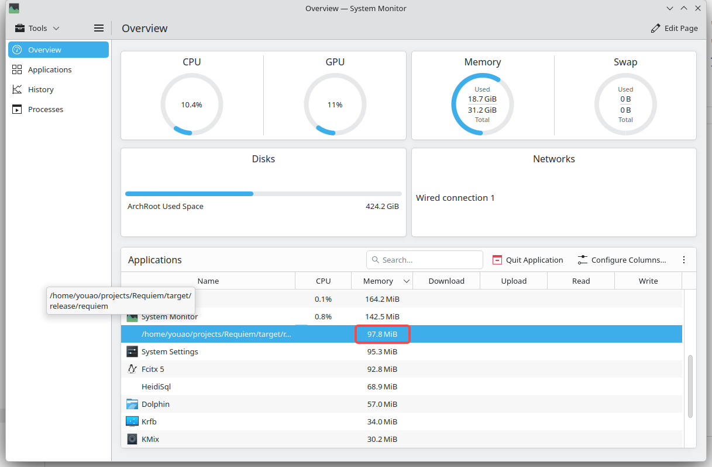
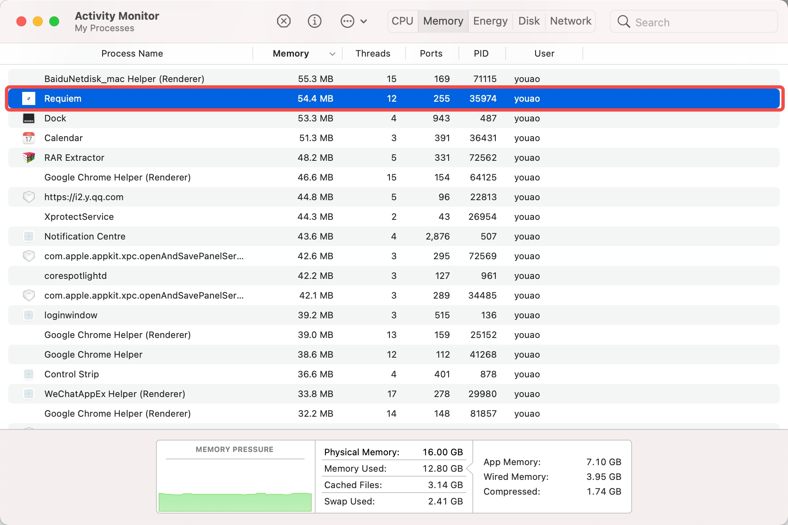
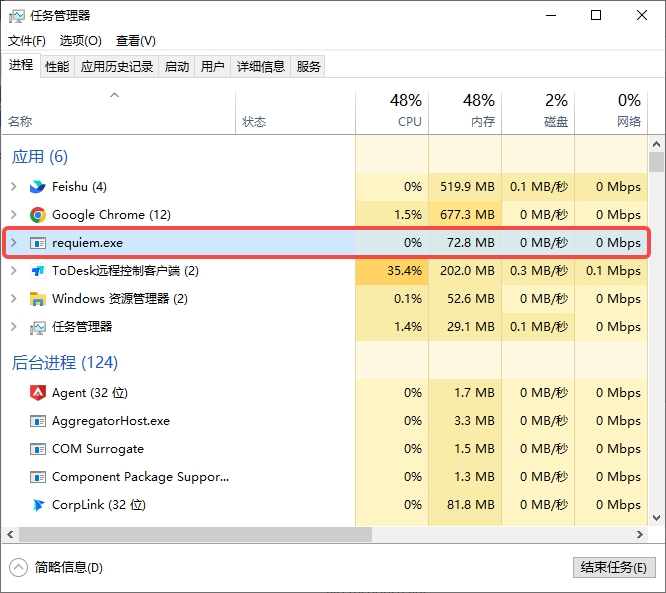

# Requiem

A lightweight HTTP client for API testing. Uses 50-100MB RAM vs Postman's 300-500MB.

[中文文档](README_CN.md)

## Features

- **Fast**: Uses 50-100MB memory, starts in under 1 second
- **Works offline**: All data saved locally, plain text files that work with Git
- **Native app**: Built with Rust and iced framework
- **Language support**: English and Chinese
- **Organize requests**: Folders and drag-and-drop
- **Environments**: Switch between dev, staging, prod, etc.
- **Syntax highlighting**: Pretty colors for JSON, XML, and more
- **AI Fill**: Paste code from your backend and let AI fill the form

## Performance
- Linux Arch/x86_64

- Macosx x86_64

- Macosx arch64
**To be added**
- Windows11 x86_64



## What's Working (v0.1.0)

- Request editor (GET, POST, headers, params, body)
- JSON, form data, raw text
- Collections with folders and drag-and-drop
- Multiple tabs
- Response viewer with syntax colors
- Environment variables
- Auth: Bearer token, Basic, API Key
- Right-click menus
- Settings
- Notifications
- Keyboard shortcuts
- English and Chinese UI

## Requirements

- Rust 2021+
- Linux, macOS, or Windows
- Chinese fonts (optional, only if you want Chinese UI)

## Install

### Arch Linux

**From AUR:**
```bash
yay -S requiem
# or
paru -S requiem
```

**From GitHub:**
```bash
wget https://github.com/youaodu/Requiem/releases/latest/download/requiem-*.pkg.tar.zst
sudo pacman -U requiem-*.pkg.tar.zst
```

More details: [Arch Linux install guide](.github/ARCH_LINUX.md)

### Build from Source

```bash
git clone https://github.com/youaodu/Requiem.git
cd Requiem

# Run it
cargo run

# Or build release
cargo build --release
./target/release/requiem
```

### Chinese Fonts (Optional)

For Chinese UI, install Source Han Sans:

**Arch Linux:**
```bash
sudo pacman -S adobe-source-han-sans-otf-fonts
```

**Other systems:**
Download Source Han Sans or change the font in `src/main.rs`.

## Development

```bash
# Run it
cargo run

# With debug logs
RUST_LOG=debug cargo run

# Check code
cargo check

# Format
cargo fmt

# Lint
cargo clippy

# Test
cargo test
```


## Performance Goals

- Memory: <100MB (aim for), <200MB (max)
- Startup: <1s

## License

MIT License - see LICENSE file.

## Contributing

Found a bug? Want a feature? Open an issue or send a PR!
