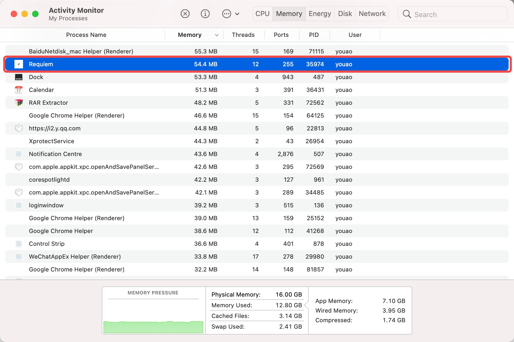

# Requiem

一个超轻量，极简洁，使用极小内存的Api管理测试工具。

## 特性

- **高性能**：内存占用 50-100MB（相比 Postman 的 300-500MB），启动时间 <1 秒
- **离线优先**：所有数据本地存储，支持 Git 版本控制
- **原生界面**：使用 iced 框架构建的原生 GUI
- **国际化**：支持中文和英文界面
- **集合管理**：支持文件夹和请求的层级组织
- **语法高亮**：请求和响应体的语法高亮显示
- **ai填充**: 粘贴服务端定义、js请求等直接填充到页面中

## 性能
- Linux Arch/x86_64

- Macosx x86_64

- Macosx arch64 
**待补充**
- Windows11 x86_64


## 功能

### 已实现功能（v0.1.0）

- ✅ 请求编辑器（方法、URL、请求头、查询参数、请求体）
- ✅ 多种请求体格式（JSON、表单数据、原始文本）
- ✅ 集合/文件夹组织，支持拖拽
- ✅ 基于标签页的请求管理
- ✅ 响应查看器，带语法高亮
- ✅ 环境变量支持
- ✅ 身份认证（Bearer、Basic、API Key）
- ✅ 右键菜单
- ✅ 设置对话框
- ✅ 消息通知
- ✅ 键盘快捷键
- ✅ 国际化（中英文）

## 系统要求

- Rust 2021 或更高版本
- Linux/macOS/Windows
- 中文字体支持（可选，用于中文界面）

## 安装与运行

### 安装
- Github release 页面有下载安装包


### 从源码构建

```bash
# 克隆仓库
git clone https://github.com/yourusername/Requiem.git
cd Requiem

# 运行开发版本
cargo run

# 构建发布版本
cargo build --release

# 运行发布版本
./target/release/requiem
```

### 字体配置（可选）

如果需要完整的中文支持，请确保系统已安装思源黑体：

**Arch Linux:**
```bash
sudo pacman -S adobe-source-han-sans-otf-fonts
```

**其他系统:**
下载并安装思源黑体，或在 `src/main.rs` 中修改字体路径。

## 开发

### 开发命令

```bash
# 开发模式运行
cargo run

# 启用调试日志
RUST_LOG=debug cargo run

# 代码检查
cargo check

# 代码格式化
cargo fmt

# 代码检查（Clippy）
cargo clippy

# 运行测试
cargo test
```


## 性能目标

- 内存使用：<100MB（目标），<200MB（最大）
- 启动时间：<1 秒

## 许可证

本项目采用 MIT 许可证 - 详见 LICENSE 文件

## 贡献

欢迎提交 Issue 和 Pull Request！
